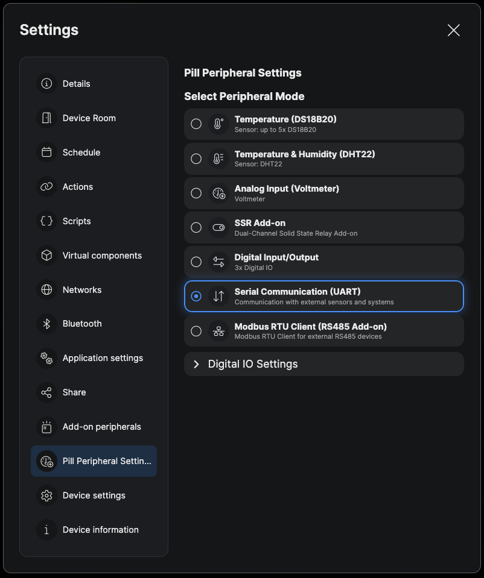
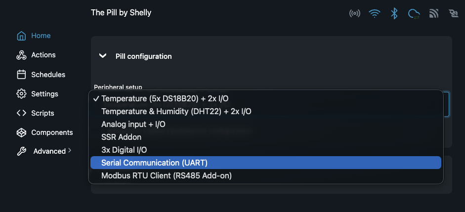

# Mitsubishi Electric heat pump control with a Shelly Pill (CN105)

Control a Mitsubishi Electric indoor unit from the Shelly app — and optionally from
Home Assistant over MQTT — using nothing but a **Shelly Pill** plugged into the unit's
**CN105** service port. No ESPHome, no extra microcontroller — one Shelly script does the
CN105 protocol and the Shelly app controls; MQTT and Home Assistant are optional add-ons.

**Requires The Pill firmware 2.0.1 or later** (the `js_uart` peripheral mode first
appeared in 2.0.1).

The protocol implementation is a port of
[echavet/MitsubishiCN105ESPHome](https://github.com/echavet/MitsubishiCN105ESPHome)
(reverse engineering by [SwiCago/HeatPump](https://github.com/SwiCago/HeatPump)).

## What is in the kit

| File | Purpose |
|---|---|
| `cn105_pill.js` | The Shelly script. Paste it into the Pill; edit the `CFG` block only for MQTT / Home Assistant. |
| `homeassistant/packages/mitsubishi_ac.yaml` | Optional Home Assistant package: climate entity + sensors + extra controls over MQTT. |
| `docs/pill-peripheral-uart.png` | Screenshot for section 2: selecting the UART peripheral mode in the Shelly app. |
| `docs/pill-peripheral-uart-webui.png` | Screenshot for section 2: the same selection in the Pill's web UI. |

What you get:

* **Shelly app**: a virtual device (group) with Power, Mode, Fan, Vane, Wide vane,
  Target temperature (slider) and Room temperature (read-only).
* **HTTP**: `GET/POST http://<pill-ip>/script/<id>/cn105` returns the state; POST a JSON
  command body to control.
* **MQTT** (optional): `<prefix>/state` (JSON, every ~10 s) and `<prefix>/set` (JSON commands).
* **Home Assistant** (optional, over MQTT): a `climate` entity (mode, target temperature, fan, vertical vane,
  hvac_action), sensors (room/target/outside temperature, compressor frequency, power,
  energy, runtime, raw mode/fan/vane), binary sensors (power, operating, link status,
  i-See), a horizontal-vane `select` and a `number` to feed an external room temperature.

## 1. Hardware

CN105 is a 5-pin JST-PA connector on the indoor unit's control board:

| CN105 pin | Signal | Note |
|---|---|---|
| 1 | 12 V | Power only — use a 12 V → 5 V buck converter to feed the Pill's USB-C. **Never** connect to a signal line. |
| 2 | GND | Common ground |
| 3 | 5 V | Reference for the level shifter's high side |
| 4 | TX (unit → Pill) | 5 V logic |
| 5 | RX (Pill → unit) | 5 V logic |

The Pill uses **3.3 V logic**, so a bidirectional level shifter is required
(a 2-channel MH-type module with the 662K LDO works well):

```
CN105 pin3 5V  -> shifter HV        (leave the shifter's LV/3V3 pin unconnected if it has its own LDO)
CN105 pin2 GND -> shifter GND (both sides) -> Pill GND
CN105 pin4 TX  -> shifter HV1 ... LV1 -> Pill IO2  (Pill RX)
CN105 pin5 RX  <- shifter HV2 ... LV2 <- Pill IO1  (Pill TX)
```

The Pill's UART is on **IO1 = TX** and **IO2 = RX**. In `js_uart` mode the firmware marks
all three IO pins as reserved; leave IO3 unconnected.

## 2. Prepare the Pill

1. Update the Pill to firmware **2.0.1 or later** (Web UI → Settings → Firmware, or the
   Shelly app).
2. Select the **Serial Communication (UART)** peripheral mode, either in the Shelly app or
   in the Pill's web UI. The script log shows this mode as `js_uart`.

   * **Shelly app:** open the Pill → **Settings** → **Pill Peripheral Settings** and under
     **Select Peripheral Mode** choose **Serial Communication (UART)** — *Communication with
     external sensors and systems*.

     

   * **Web UI** (`http://<pill-ip>/`): **Home** → **Pill configuration** → **Peripheral setup**
     → **Serial Communication (UART)**.

     

You do not need to set the baud rate or parity. The script puts serial port 0 into
`js_uart` 2400 8E1 on every start and fixes it without a reboot if something changed it —
a firmware update, for example, resets the port to 115200 8N1.

Note: firmware 2.0.1 reports the Serial mode as `js_uart`, while the API documentation's
example shows `jsuart`. The script accepts both spellings.

## 3. Install the script

1. Web UI → **Scripts** → **Add script**, paste the whole `cn105_pill.js`, **Save**, **Start**,
   and enable **Run on startup**. For control from the Shelly app the file needs no changes;
   the `CFG` block is edited only for MQTT / Home Assistant (section 4). Optional:
   `VC_GROUP_NAME` sets the name of the virtual device in the Shelly app.

2. Watch the script log. A start looks like this, and a state line follows every poll
   cycle (~10 s):

   ```
   [cn105] Fixing Serial config -> js_uart 2400 8E1
   [cn105] UART 2400 8E1
   [cn105] Connected to heat pump (0x7A)
   [cn105] fw=2.0.1 app=Pill
   [cn105] Pill mode="js_uart" pin0="reserved" pin1="reserved" pin2="reserved"
   [cn105] Virtual components ready (group MitsubishiAC)
   [cn105] {"connected":true,"power":"ON","mode":"HEAT","temp":21,"fan":"AUTO",...,"room_temp":22.5,...}
   ```

   The exact order of the lines can vary. `Fixing Serial config` appears only when the
   serial port was not already 2400 8E1. With the default `MQTT_ENABLE: false` the script
   does not touch MQTT at all.

### Start-up order

Firmware 2.0.1 stops a script that has more than five RPC calls in flight at once
(`Too many calls in progress`). The script therefore starts in stages, one after another:
serial port and CN105 link first, then diagnostics, then the virtual components and
finally the MQTT broker settings (only with `MQTT_ENABLE: true` and `MQTT_HOST` set, section 4). If you add your
own `Shelly.call()`s, start them after the `Virtual components ready` line, not at the top
level of the script.

## 4. MQTT and Home Assistant (optional)

Home Assistant talks to the script over MQTT. Skip this section if you only use the Shelly
app. The same MQTT topics also work with other systems, such as Node-RED (section 5).

You need an MQTT broker and, for Home Assistant, the MQTT integration connected to the same
broker as the Pill.

### MQTT settings in the script

Edit the `CFG` block at the top of `cn105_pill.js` and save the script again.
`MQTT_ENABLE` is the master switch — with the default `false` nothing below is used:

```js
MQTT_ENABLE: true,           // turn MQTT on (default false = Shelly app and HTTP only)
MQTT_HOST: "192.168.1.10",   // your broker ("" = configure MQTT in the web UI instead)
MQTT_PORT: 1883,
MQTT_USER: "mqtt",
MQTT_PASS: "secret",
MQTT_PREFIX: "mitsuac",      // topic prefix, must match the HA package

HA_DISCOVERY: false,         // false = use the HA package (default), true = script announces the climate itself
HA_DISC_ID: "mitsuac",       // KEEP STABLE — changing it creates a new entity in HA
HA_NAME: "MitsubishiAC",
HA_DEVICE_NAME: "MitsubishiAC",
```

### How the MQTT broker settings are applied

If `MQTT_ENABLE` is `true` and `MQTT_HOST` is set, the script writes host/port/user/password into the Pill's own MQTT
component on first start and **reboots the Pill once** to activate it. This is the last
start-up stage, so the reboot never interrupts the creation of the virtual components. It also sets the
Shelly MQTT **prefix** to `MQTT_PREFIX`, so the device's online/offline (LWT) topic becomes
`<prefix>/online` — that is what the Home Assistant package uses for availability.

A signature of the applied values is stored in the Pill's KVS, so:

* editing the password in `CFG` and re-saving the script re-applies it (one more reboot),
* an unchanged config never reboots again,
* if the config does not stick after 3 attempts the script gives up and logs an error.

If you prefer to configure MQTT by hand (`MQTT_HOST: ""`), set the **MQTT prefix** in the
web UI to the same value as `MQTT_PREFIX`; the script logs a warning if they differ.

The first start with `MQTT_HOST` set looks like this:

```
[cn105] UART 2400 8E1
[cn105] Connected to heat pump (0x7A)
[cn105] fw=2.0.1 app=Pill
[cn105] Pill mode="js_uart" pin0="reserved" pin1="reserved" pin2="reserved"
[cn105] Virtual components ready (group MitsubishiAC)
[cn105] Applying MQTT broker 192.168.1.10:1883 user=mqtt prefix=mitsuac (attempt 1)
[cn105] MQTT config applied — rebooting once to activate it
```

After that reboot, and on every later start, the MQTT lines are gone.

### Option A — package (default, recommended)

1. Copy `homeassistant/packages/mitsubishi_ac.yaml` to `<config>/packages/`.
2. Make sure `configuration.yaml` loads packages:

   ```yaml
   homeassistant:
     packages: !include_dir_named packages
   ```

3. Restart Home Assistant. A device **MitsubishiAC** appears under the MQTT integration
   with `climate.mitsubishiac` and the sensors/controls listed above.

The package contains the climate entity, so leave `HA_DISCOVERY: false` in the script.
The package and the script's discovery use the **same** `unique_id`s, so if you switch
between the two later HA keeps the same entities instead of creating duplicates.

### Option B — MQTT discovery (no YAML)

Set `HA_DISCOVERY: true` (together with `MQTT_ENABLE: true`) in the script and do not install the package. The script publishes
a retained discovery message for the climate entity and re-publishes it every time HA
starts (it listens to HA's birth message on `homeassistant/status`), so the entity survives
broker restarts and HA restarts without any manual step. You get the climate entity only —
no extra sensors.

### Feeding an external room temperature

The pump normally uses its own intake sensor. To use a room sensor instead, write it to
`number.mitsubishiac_remote_temperature` periodically (0 switches back to the internal sensor):

```yaml
automation:
  - alias: "Mitsubishi AC - use room sensor"
    triggers:
      - trigger: state
        entity_id: sensor.living_room_temperature
    actions:
      - action: number.set_value
        target:
          entity_id: number.mitsubishiac_remote_temperature
        data:
          value: "{{ states('sensor.living_room_temperature') | float }}"
```

The script re-sends the value every 20 s and reverts to the internal sensor if it has not
been refreshed for 30 minutes (`REMOTE_TEMP_*` in `CFG`).

### Renaming or a second heat pump

Entity ids derive from the names in the package (`MitsubishiAC` → `climate.mitsubishiac`,
`sensor.mitsubishiac_room_temperature`, …). To rename, search-and-replace `MitsubishiAC`
in the package (and set `HA_NAME`/`HA_DEVICE_NAME` in the script to the same value).
For a second unit, copy the package file and replace **both** `mitsuac` (topics and
`unique_id`s) and `MitsubishiAC`, and use the same `MQTT_PREFIX` / `HA_DISC_ID` / names
in that Pill's script. The virtual component ids inside a Pill (200–207) are per device
and need no change.

## 5. MQTT reference

Only when MQTT is set up (section 4, `MQTT_ENABLE: true`).

State — `<prefix>/state`, published after every poll cycle (~10 s):

```json
{"connected":true,"power":"ON","mode":"HEAT","temp":21.5,"fan":"AUTO","vane":"AUTO",
 "wideVane":"|","iSee":false,"room_temp":22.5,"outside_temp":null,"operating":true,
 "compressor_hz":37,"input_power_w":0,"energy_kwh":0,"runtime_hours":0,"remote_temp":0}
```

`outside_temp` is `null` on units without an outdoor sensor reading; `input_power_w`,
`energy_kwh` and `runtime_hours` are 0 on units that do not report them.

Commands — `<prefix>/set`, any subset of keys in one JSON object:

| Key | Values |
|---|---|
| `power` | `"ON"`, `"OFF"` |
| `mode` | `"HEAT"`, `"DRY"`, `"COOL"`, `"FAN"`, `"AUTO"` |
| `temp` | 16 … 31 (0.5 steps) |
| `fan` | `"AUTO"`, `"QUIET"`, `"1"`, `"2"`, `"3"`, `"4"` |
| `vane` | `"AUTO"`, `"1"` … `"5"`, `"SWING"` |
| `wideVane` | `"<<"`, `"<"`, `"\|"`, `">"`, `">>"`, `"<>"`, `"SWING"` |
| `remote_temp` | 1 … 40, `0` = use the unit's internal sensor |

Example: `mosquitto_pub -t mitsuac/set -m '{"power":"ON","mode":"HEAT","temp":22}'`

The same JSON works as the body of `POST http://<pill-ip>/script/<id>/cn105`.

## 6. Troubleshooting

| Symptom | Cause / fix |
|---|---|
| `No reply to CONNECT, retrying` forever | Wiring (TX/RX crossed, missing GND, level shifter unpowered) or the unit is not powered. Also check that the log says `UART 2400 8E1` — CN105 needs **even parity**. |
| `Pill is NOT in js_uart mode` or `UART API not available` | The peripheral mode is wrong. Select **Serial Communication (UART)** in the Shelly app or web UI (section 2). |
| `Serial.SetConfig failed` or `boot gave up` | The serial port could not be set to `js_uart` 2400 8E1. Check that the firmware is 2.0.1 or later and **Serial Communication (UART)** is selected (section 2). |
| Script stops right after start with `Too many calls in progress` | More than five RPC calls were in flight. The shipped script never does this; if you added your own `Shelly.call()`s, move them after start-up (see *Start-up order*). |
| `ERROR: frame truncated … (zero-byte problem)`, or connected but data never arrives | The firmware dropped `0x00` bytes from the frame string. Not seen on 2.0.1; update the firmware. |
| `VC creation failed (number:205)` | A Number virtual component needs a `default_value` inside `min…max`. The slider takes its range from `MIN_TEMP`/`MAX_TEMP` and computes the default as their midpoint, so this only happens if `MIN_TEMP` > `MAX_TEMP` or they are not numbers. |
| Entities `unavailable` in HA | Check that `MQTT_ENABLE` is `true`. The availability topic is `<MQTT_PREFIX>/online`. Check in MQTT Explorer that it exists and is `true`; if the Pill publishes under another prefix, set the web UI MQTT prefix to `MQTT_PREFIX` (or set `MQTT_HOST` so the script does it). |
| `WARNING: device MQTT is disabled` | `MQTT_ENABLE` is `true` but MQTT is off on the Pill. Set `MQTT_HOST` in the script or enable MQTT in the web UI (section 4). |
| `NOTE: MQTT_HOST is set but MQTT_ENABLE is false` | MQTT is still off. Set `MQTT_ENABLE: true` to use the broker settings. |
| MQTT shows *disconnected* in the Pill web UI | Wrong host/port/credentials. The broker port is usually 1883 — not 1880 (Node-RED) or 8123 (HA). |
| Both a discovery entity and a package entity | `HA_DISCOVERY` is `true` **and** the package is installed. Pick one; with identical `unique_id`s HA ignores the second and logs a warning. |
| Pill reboots once right after the first start | Expected: the script applied the MQTT broker settings. It does not happen again unless you change them. |
| `MQTT config did not persist after 3 attempts` | The Pill did not keep the broker settings. Configure MQTT in the web UI, set its MQTT prefix to `MQTT_PREFIX` and set `MQTT_HOST: ""` in the script. |

Debug output: set `DEBUG: true` in `CFG` to log every UART frame in hex.

## 7. Notes on the CN105 protocol

* 2400 baud, 8 data bits, **even** parity, 1 stop bit.
* Every frame starts with `0xFC`, byte 4 is the payload length, last byte is a checksum
  `(0xFC − sum(bytes)) & 0xFF`.
* CONNECT `FC 5A 01 30 02 CA 01 A8` → reply type `0x7A`. Data requests (`0x42`) are
  zero-padded to 22 bytes, replies are type `0x62` with the request code in byte 5.
* The script polls settings (`0x02`), room temperature (`0x03`) and status (`0x06`)
  every 10 s; add `0x09` to `POLL` for standby/sub-mode diagnostics.

## License and credits

Protocol knowledge: SwiCago/HeatPump and echavet/MitsubishiCN105ESPHome (both open
source). This kit is provided as-is; use at your own risk — you are connecting to the
service port of a mains-powered appliance.
